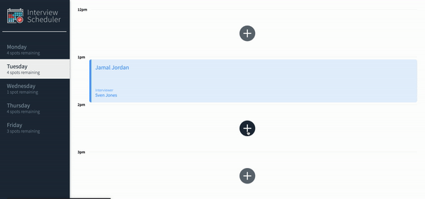

# Interview Scheduler
Scheduler is a single-page **React** application allowing the user to book, edit, and cancel interviews. 

* Database: Api Server using **PostgreSQL** Database
* Testing: **Jest**, **StoryBook**, **Cypress** 


## How to 📖 an appoinment 



## Setup

Install dependencies with `npm install`.

## Running Webpack Development Server

```sh
npm start
```

## Running Jest Test Framework

```sh
npm test
```

## Running Storybook Visual Testbed

```sh
npm run storybook
```
## Dependencies

  * axios 0.26.1 
  * classnames 2.2.6
  * normalize.css 8.0.1
  * react 16.9.0
  * react-dom 16.9.0
  * react-scripts 3.0.0
  